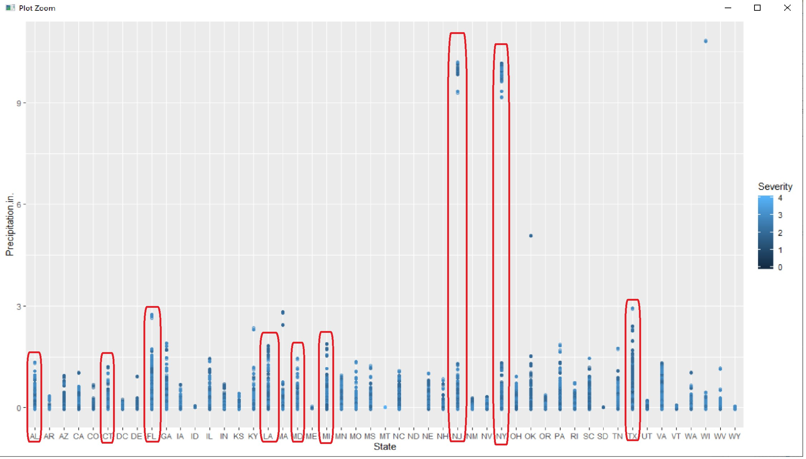

```{r setup, include=FALSE}
knitr::opts_chunk$set(echo = TRUE)

library(readr)
library("data.table") 
library(ggplot2)
library(corrplot)
library(dplyr)
library(usmap)
library("ggmap")

key_data_bad_drivers_csv <- read.csv("key_data_bad_drivers_csv.csv",stringsAsFactors=TRUE)

accidents <- read.csv("US_Accidents_May19.csv",stringsAsFactors=TRUE)

#COMBINE 3 ACCIDENT ATTRIBUTES TO 1 DATAFRAME:
accidents_gps <-data.frame(accidents$Start_Lng,accidents$Start_Lat)
str(accidents_gps)

#COMBINE 6 ACCIDENT ATTRIBUTES TO 1 DATAFRAME:
accidents_sev_state_gps_wethr <- data.frame(accidents$State,accidents$ Start_Lng,accidents$Start_Lat,accidents$Severity,accidents$Temperature.F.,accidents$Precipitation.in.,accidents$Visibility.mi.)

```

## Problem statement:

Traffic in the U.S. has always been a problem that is influenced by many factors. Many influential factors such as higher insurance cost, injury/death are the result of this problem but also traffic is influenced by certain factors such as overpopulation and weather.  I wish to seek how these factors influence and are influenced by traffic.  To accomplish this, I will need to pull multiple data sets: (Traffic, Weather, insurance cost) to see if I can form a geographical correlation between these factors. 

## Research Questions:

What regions are more prone to more accidents?
What is the relationship between bad weather (ie frequent rain, snow) to accidents and death?
What regions have higher insurance rates?  Is there a correlation to weather, higher accidents per mile driven, traffic deaths?
Which areas have more bad drivers? 
Is there a correlation of # of accidents to bad weather by region?

## Prep the data:

The approach will be to load the data, then munging the data: isolate the needed data (dependent, independent variable).  Once variables are loaded into a dataset, then cleansing and standardizing units of measure, and determining appropriate data types. 


### the Data:

#### The data is obtained is from 2 key sources: 

##### Data set: https://www.kaggle.com/biphili/road-accidents-in-us/data
 
1.	Accident Date/Time:
a.	Cleansing- need to separate date/time fields
2.	Accident GPS Coordinates:
a.	Need to convert the City, State for each given GPS coordinates
3.	Severity: (0 to 4)
a.	Determine the weight each accident carries, equate to amount damage
4.	Precipitation
a.	In inches
b.	Clean n/a
c.	Convert binary attribute for rain/no rain

##### Data set: https://datahub.io/five-thirty-eight/bad-drivers#r

1.	Car insurance Premiums:
a.	Determine by state
2.	Losses incurred by insurance companies for collisions per insured driver:
a.	Determine by state
3.	% of drivers involved in fatal collisions per billion miles:
a.	Determine how this number affects insurance rates
4.	% of drivers involved in fatal collisions who were alcholo-impaired
a.	Determine correlation to insurance premiums


### Approach: lets look at the data by state:

We can see the states with the highest insurance premiums.

```{r , echo=FALSE,warning=FALSE,error=FALSE}
library(readr)

#str(key_data_bad_drivers_csv)

df<-arrange(key_data_bad_drivers_csv,desc(car.insurance.premiums....))
df %>% select(state,car.insurance.premiums....) %>% head()

#Bad_drive_prem_order <- select(bad_driver_st_prem[order(bad_driver_st_prem$key_data_bad_drivers_csv.car.insurance.premiums....),])
#head(Bad_drive_prem_order)
```
#### Data by state - map: 

```{r , echo=FALSE,warning=FALSE,error=FALSE}


premium_data_fips <- key_data_bad_drivers_csv %>%
  filter(key_data_bad_drivers_csv$car.insurance.premiums....>100)
premium_data_fips$state <- fips(premium_data_fips$state)
setnames(premium_data_fips, old=c("state"), new=c("fips"))
plot_usmap(data = premium_data_fips, values= "car.insurance.premiums....",labels = TRUE)+ scale_fill_continuous(low= "yellow", high= "red") + theme(legend.position = "right") +labs(title = "States: $ Insurance premiums")


```

#### Correlation check across key data sets:
  

Next,

  Lets see if there is an obvious correlation between key attributes associated with bad driving: DWI, distraction, # accidents per miles driven.  
  A quick pairs() function will show such relationship:
  
 

```{r, echo=TRUE,warning=FALSE,error=FALSE}

pairs(key_data_bad_drivers_csv)
```

##### Correlation found:

- Chart analysis: in all graphs, the only strong relationship is the bottom right corner on chart above:
    - Correlation found is between: Premiums ($) and  Claims per insured ($)
      Insurance Premiums vs losses incurred by insurance companies for collisions per insured driver
      
  **-Results:** 
  
  This relationship is an obvious one: the more claims you make, the higher you pay.   
  
 
 
```{r , echo=TRUE,warning=FALSE,error=FALSE}

#Graphing premiums by losses per collision:
library(ggplot2)
	ggplot(data=key_data_bad_drivers_csv,aes(x=losses.incurred.by.insurance.companies.for.collisions.per.insured.driver....,y=car.insurance.premiums....))+geom_point() +geom_smooth(method = "lm", se = FALSE)

```

#### Next: Dive into what drives these higher claims- **weather**

 living in area that is prone to higher accidents?

### LM() to show relationship for P-values:


```{r , echo=FALSE,warning=FALSE,error=FALSE}
library(readr)

cor.test(accidents$Precipitation.in.,accidents$Severity, method = c("pearson"))
cor.test(accidents$Temperature.F.,accidents$Severity, method = c("pearson"))
cor.test(accidents$Visibility.mi.,accidents$Severity, method = c("pearson"))
```

**Corelation between accidents shows:** 

    -Accident severity to Precipitation: 0.0159
    -Accident severity to Temperature: 0.009
    -Accident severity to Visibility: -0.007
    
**Conclusion:** Precipitation shows the strongest correlation at 0.0159

**Graphing relationship of rain to accident severity:**

```{r , echo=TRUE,warning=FALSE,error=FALSE}


plot(accidents_sev_state_gps_wethr$accidents.Precipitation.in.,accidents_sev_state_gps_wethr$accidents.Severity,,method = "lm", se = FALSE,
       main="Relationship Between Precipitation and Severity (accident)",
       xlab="Precipitation",
       ylab="Severity (accident)")

```

Shown here is a slight relationship of severity to rain. Now to dive in to this further, I want to show this percipitation relationship by state:  with Accident Severity category (0-4):

#RAIN BY STATE (ACCIDENTS)

```{r , echo=TRUE,warning=FALSE,error=FALSE}
ggplot(data=accidents_sev_state_gps_wethr,aes(x=accidents.State,y=accidents.Precipitation.in.,color=accidents.Severity)) +geom_point()+ 
  geom_jitter(width=0,height=0.05, alpha = .5)+ geom_smooth(method = "lm", se = FALSE)
```


Graph shows states (highlighted) in RED below, which are within the top 15 States with highest premiums.  There does show more accidents at higher rain amounts.  There is a small visual correlation.  



# Temp by Severity (State):

I wanted to now understand graphically where most accidents fall (by severity): (states)
	(show 4 graphs: w/ severity 1-4)
Wanted to see regions with most and overall accidents:


```{r , echo=FALSE,warning=FALSE,error=FALSE}

us <- c(left = -125, bottom = 25.75, right = -67, top = 49)
get_stamenmap(us, zoom = 5, maptype = "toner-lite") %>% ggmap()+ geom_point (aes(x=accidents.Start_Lng, y=accidents.Start_Lat,color=accidents.Severity),data=accidents_sev_state_gps_wethr, alpha = 0.25)   


```

### K-Mean:

Using machine learning, wanted to find the optimum K value to determine right # of clusters to map.

Using K-mean across multiple k-values, we can create a % accuracy table and elbow chart to see the optimal # of clusters:

```{r , echo=FALSE,warning=FALSE,error=FALSE}

#K VALUE CALCULATIONS:========================================

# calc & store K=5 thru 25 and % accuracy

runs <- 1:6
kvalues <- integer()
kvalues <- c(3,5,10,15,20,25)
all_betweenss <-integer()
all_totss <-integer()


for (v in runs){
  v
  kmean_temp <-kmeans(accidents[,7:8],centers=(kvalues[v]))
  kmean_temp
  all_betweenss[v]<-kmean_temp$betweenss
  all_totss[v]<-kmean_temp$totss
}

# Calculate % Accuracy, Store in matrix: 
Kvalue_accy_table <- all_betweenss/all_totss
Kvalue_accy_table<-data.frame(Kvalue_accy_table)
K_5_25 <- c(3,5,10,15,20,25)

k_vals<-data.frame(K_5_25,Kvalue_accy_table)
names(k_vals) <- c("Kvalues","Kvalue_accy_table")
k_vals
#Plot of K-Accuracy
ggplot(data=k_vals,aes(x=K_5_25, y=Kvalue_accy_table)) + geom_line() +geom_point() + ggtitle("Plot of K-Values Accuracy") +
  xlab("K Value") + ylab("K Accuracy %")
```

### CLUSTERS: 

 Once we use K-mean to get optimal # of Clusters: 5 to 10, we proceed to graph. 
There is some evidence of higher rates due to flooding / accidents in rain, but what else drives the other states to higher insurance rates?  Next I want to see if graphing our optimal 'Clusters' can be overlayed on our accidents map and be a possible cause of higher rates. Insureance can maybe use these high risk 'cluster' areas and a reason to increase neighboring states due to proximity risk.

#### 5 Cluster map:
 
 Starting with cluster = 5 map, let's see how this well the cluster fit the cluster of car accidents:

```{r , echo=FALSE,warning=FALSE,error=FALSE}

Kmean_5 <- kmeans(accidents_gps,center=5, nstart=10)

plot(accidents_gps, col=Kmean_5$cluster,main="Data Plot: K = 5")
points(Kmean_5$centers, pch=3, cex=2) # add the centroids
text(Kmean_5$centers, labels=1:5, pos=2) # add the cluster ID

```
#### 10 Cluster map:

NOw Comparing to Cluter = 10: 
```{r, echo=FALSE,warning=FALSE,error=FALSE}

Kmean_10 <- kmeans(accidents_gps,center=10, nstart=10)

plot(accidents_gps, col=Kmean_10$cluster,main="Data Plot: K = 10")
points(Kmean_10$centers, pch=3, cex=2) # add the centroids
text(Kmean_10$centers, labels=1:10, pos=2) # add the cluster ID

```
#### Mapping regions with highest Insurance Premiums:

Now, if we look to see where the high insurance premium states fall, we see potental clusters of high risk areas:

-**Cluster # 7:** 
    -contains some of the highest Premium states: NY, NJ,RI,MA, CT, MD, DE, DC
    -NJ & NY showed high accidents during high precipitation.
     
-**Cluster # 8:** 
    -FL is the single state in a cluster with high premiums
    -FL showed high accidents during high precipitation.
     
-**Cluster # 5:**
    -Contains TX and LA. Both are high premium states.
    -both showed high accidents during high precipitation.


## Conclusion:

We can see there are certain circumstantial that influence insurance rates.  Some of the obvious ones are high # of claims ($ paid out/ insured). Weather does seem to play a part in driving rates higher, as shown in percipitation accident event graph.  And there may be proximity risks associated to if one lives in areas prone to accidents.

- **Prior claims:** We saw the most influence (correlation) on our insurance rates are prior claims. Insurance companies will take total claims impacting their client base and determine $ claims paid per insured. This showed the highest correlation.

-**Weather:** 
- Temperature: Not a strong correlation found on temperatures to accidents.
- Percipitation: There is a correlation between higher percipitation (in inches) and the states with higher insurance rates.  This may be to the fact that rain causes a higher incidence of accidents in high traffic areas in these states. 
-**Clusters:**:
-Using K-mean and optimizing cluster #, I find that there is an optimal # of clusters % accuracy is between: 5 = 95%  and 10 = 98%.  
Looking at these clusters, I see that clusters # 5, 7, 8 has a heavy # of accidents which was a near neighbor to key expensive states. 

## Limitations:

There are further contributing factors that can be analyzed to see if they contribute to higher insurance premiums.  Such as age of drivers, type of cars driven, crime, congestion (population/mile),etc.  All these can play a part in what insurance companies factor into our insurance premiums.  Also, my analysis was at the state level, so diving down to the city level could expose a more consistent pattern in insurance premiums.
